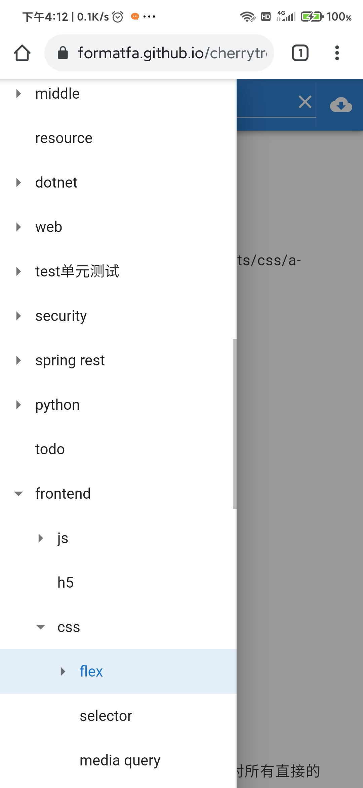
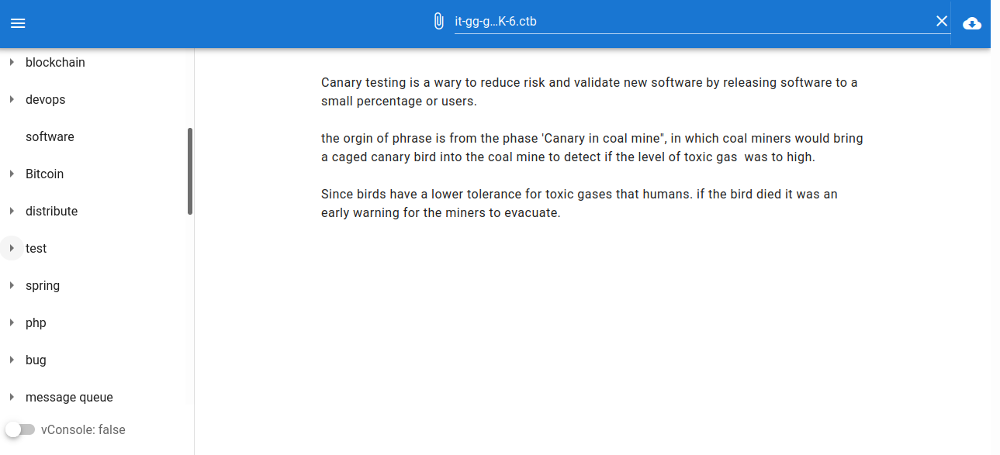

# cherrytree-web

read cherrytree .ctb file in a browser




### TODO

- open multiple files once
- codebox,image and codebox support

### Other

- use sql.js to read sqlite
  https://sql.js.org/#/

## Project setup

```
yarn install
```

### Compiles and hot-reloads for development

```
yarn serve
```

### Compiles and minifies for production

```
yarn build
```

### Lints and fixes files

```
yarn lint
```

### Customize configuration

See [Configuration Reference](https://cli.vuejs.org/config/).
